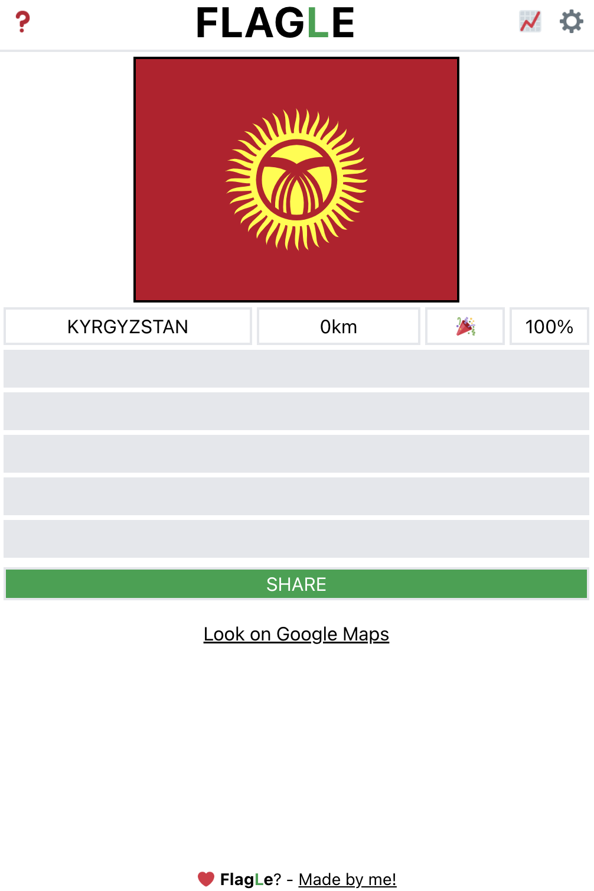

# Flagle: A Wordle inspired web-app but with flags from around the world #

Play Flagle here: https://flagle.vercel.app/ !

Table of Contents
-----------------

  * [Introduction](#introduction)
  * [Installation](#installation)
  * [Usage](#usage)
  * [Directory Folders](#directory-folders)
  * [Tests](#tests)
  * [Open Issues](#Issues)
  * [Contact](#contact)
  * [References](#references)

Introduction
------------

Flagle is a daily flag guessing game, inspired from @teuteuf Worldle based game. Every day a new World flag will appear, be it one of a country, territory or city. You have 5 guesses to get the correct flag, after each guess if it's not right you will be pointed to the direction and distance of the correct place in kilometres. Guess the correct flag and share with your friends, maintaining a streak of daily correct guesses.

Installation
------------
Clone the repository:
### `git clone https://github.com/amckenna41/flagle.git`

Install all the required module dependancies from the main flagle dir.
### `npm install`

Usage
-----
Runs the app in the development mode from the main flagle dir.
Open [http://localhost:3000](http://localhost:3000) to view it in your browser.
### `npm start`
Directory Folders
-----------------

* `/public` - contains static files such as index. html, javascript library files, images, and other assets, etc.
* `/src` - source code for react app.
* `/scripts` - scripts for getting various country and subdivision flags.
* `/images` - images used in repo.

Tests
-----
Launches the test runner in the interactive watch mode.
See the section about [running tests](https://facebook.github.io/create-react-app/docs/running-tests) for more information.
### `npm test`

Open Issues
-----------
Any issues, errors or bugs can be raised via the [Issues](https://github.com/amckenna41/flagle/issues) tab in the repository. 

Contact
-------

If you have any questions or feedback, please contact amckenna41@qub.ac.uk or visit my [LinkedIn](https://www.linkedin.com/in/adam-mckenna-7a5b22151/):

References
----------
\[1\]: Countries with long/lat => https://developers.google.com/public-data/docs/canonical/countries_csv
\[2\]: French country names => https://fr.wikipedia.org/wiki/ISO_3166
\[3\]: Country images => https://github.com/djaiss/mapsicon
\[4\]: Fixed images => http://www.amcharts.com/svg-maps/
